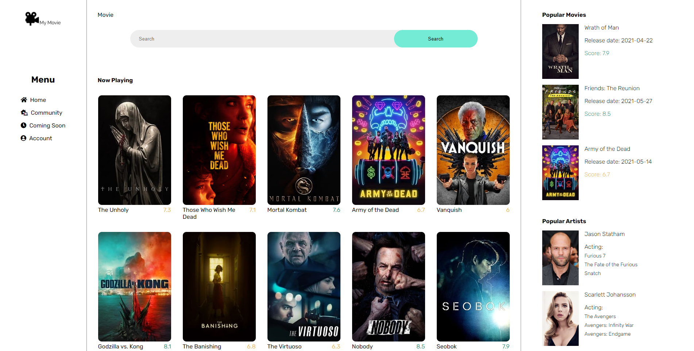
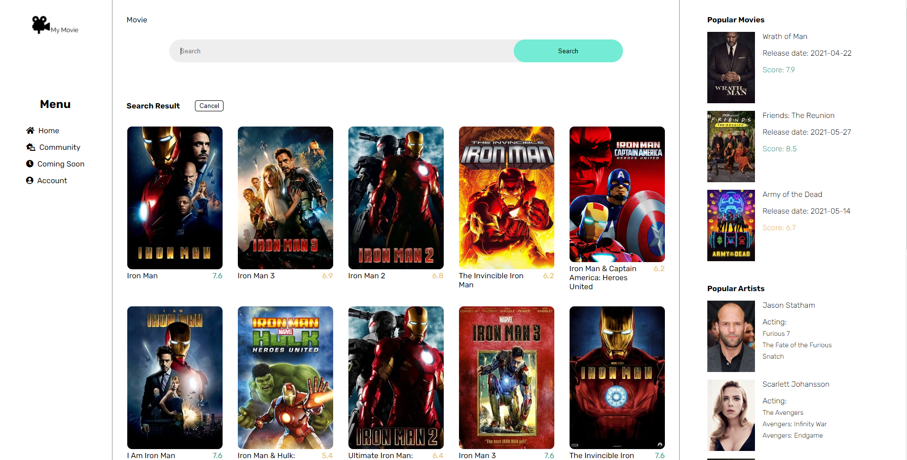
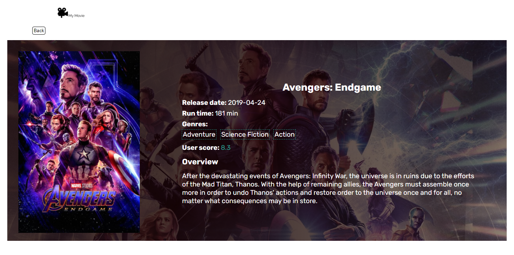
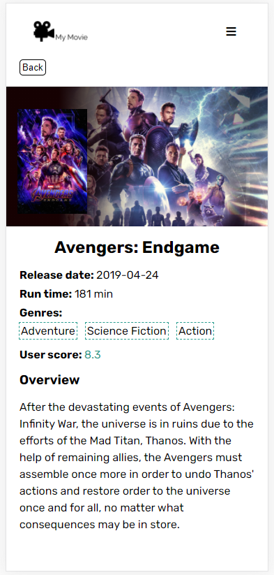

# MovieAPP
The MovieAPP focuses on exploring the world of movies and sharing love of moives.

## Table of contents
* [General info](#General-info)
* [Technologies](#Technologies)
* [Setup](#Setup)


## General-info
1. Receive latest information on movies and artists.
<p align="center">

<p>
2. Search your favorite movies.
<p align="center">

<p>
3. Explore detail information of your favorite movies.
<p align="center">

<p>
4. Responsive design.
<p align="center">

<p>


## Technologies
Project is created with:
* React version: 17.0.2

## Setup
#### Frontend 
1. Apply for a API key from <a href='https://www.themoviedb.org/' target='_blank'>TMDB</a>.
2. Create a .env file inside the root folder and store the API key as REACT_APP_API_KEY='your API key'.
3. install and start the website.
```bash
npm install
npm start
```

